## 一、数据库操作
### 1、创建model表
 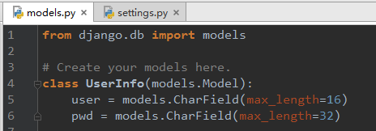
 
** 基本结构: **

```
from django.db import models

class userinfo(models.Model):
#如果没有models.AutoField，默认会创建一个id的自增列
name = models.CharField(max_length=30)
email = models.EmailField()
memo = models.TextField()
```

**更多字段:**

- 1.  models.AutoField 自增列= int(11) 如果没有的话，默认会生成一个名称为 id 的列，如果要显示的自定义一个自增列，必须将给列设置为主键 primary_key=True。
- 2.  models.CharField 字符串字段必须 max_length 参数
- 3.  models.BooleanField 布尔类型=tinyint(1)不能为空，Blank=True
- 4.  models.ComaSeparatedIntegerField 用逗号分割的数字=varchar 继承CharField，所以必须 max_lenght 参数
- 5.  models.DateField 日期类型 date对于参数，auto_now =True则每次更新都会更新这个时间；auto_now_add 则只是第一次创建添加，之后的更新不再改变。
- 6.  models.DateTimeField 日期类型 datetime同DateField的参数
- 7.  models.Decimal 十进制小数类型= decimal必须指定整数位max_digits和小数位decimal_places
- 8.  models.EmailField 字符串类型（正则表达式邮箱）=varchar对字符串进行正则表达式
- 9.  models.FloatField 浮点类型= double
- 10.  models.IntegerField 整形
- 11.  models.BigIntegerField 长整形
```
integer_field_ranges ={
'SmallIntegerField':(-32768,32767),
'IntegerField':(-2147483648,2147483647),
'BigIntegerField':(-9223372036854775808,9223372036854775807),
'PositiveSmallIntegerField':(0,32767),
'PositiveIntegerField':(0,2147483647),
}
```
- 12.  models.IPAddressField 字符串类型（ip4正则表达式）
- 13.  models.GenericIPAddressField 字符串类型（ip4和ip6是可选的）参数protocol可以是：both、ipv4、ipv6验证时，会根据设置报错
- 14.  models.NullBooleanField 允许为空的布尔类型
- 15.  models.PositiveIntegerFiel 正Integer
- 16.  models.PositiveSmallIntegerField 正smallInteger
- 17.  models.SlugField 减号、下划线、字母、数字
- 18.  models.SmallIntegerField 数字数据库中的字段有：tinyint、smallint、int、bigint
- 19.  models.TextField 字符串=longtext
- 20.  models.TimeField 时间 HH:MM[:ss[.uuuuuu]]
- 21.  models.URLField 字符串，地址正则表达式
- 22.  models.BinaryField 二进制
- 23.  models.ImageField图片
- 24.  models.FilePathField文件

**更多参数:**

- 1.  null=True
数据库中字段是否可以为空
- 2.  blank=True
django的Admin中添加数据时是否可允许空值
- 3.  primary_key =False
主键，对AutoField设置主键后，就会代替原来的自增 id 列
- 4.  auto_now 和 auto_now_add
auto_now 自动创建---无论添加或修改，都是当前操作的时间
auto_now_add 自动创建---永远是创建时的时间
- 5.  choices
GENDER_CHOICE =(
(u'M', u'Male'),
(u'F', u'Female'),
)
gender = models.CharField(max_length=2,choices = GENDER_CHOICE)
- 6.  max_length
- 7.  default 默认值
- 8.  verbose_name Admin中字段的显示名称
- 9.  name|db_column 数据库中的字段名称
- 10.  unique=True 不允许重复
- 11.  db_index =True 数据库索引
- 12.  editable=True 在Admin里是否可编辑
- 13.  error_messages=None 错误提示
- 14.  auto_created=False 自动创建
- 15.  help_text 在Admin中提示帮助信息
- 16.  validators=[]
- 17.  upload-to

### 2、注册APP，settings添加app
### 3、生成相应的表
```
python manage.py makemigrations
python manage.py migrate
```
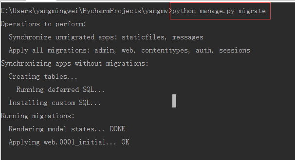

### 4、admin后台注册表
 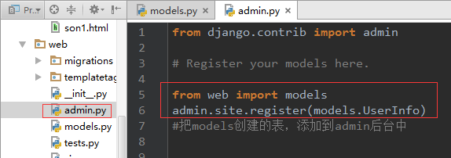

`python manage.py createsuperuser`创建用户

 后台可以管理，添加数据
 
 
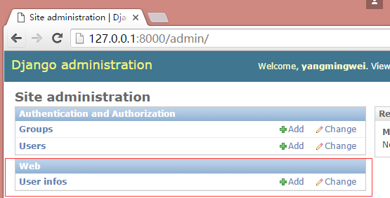


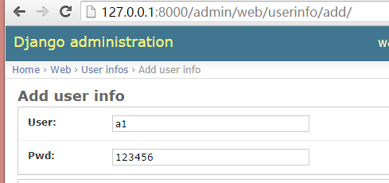


## 二、对数据进行增删改查

### 1、查

```
models.UserInfo.objects.all()
models.UserInfo.objects.all().values('user')    #只取user列
models.UserInfo.objects.all().values_list('id','user')    #取出id和user列，并生成一个列表
models.UserInfo.objects.get(id=1)
models.UserInfo.objects.get(user='yangmv')
```
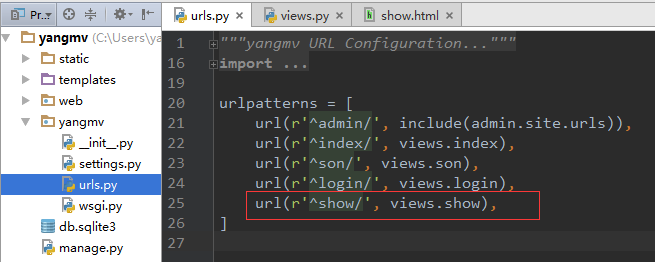

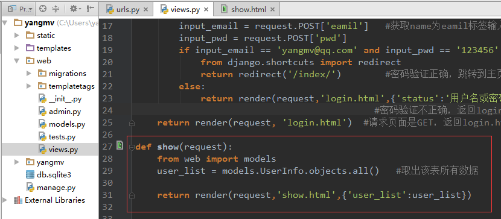

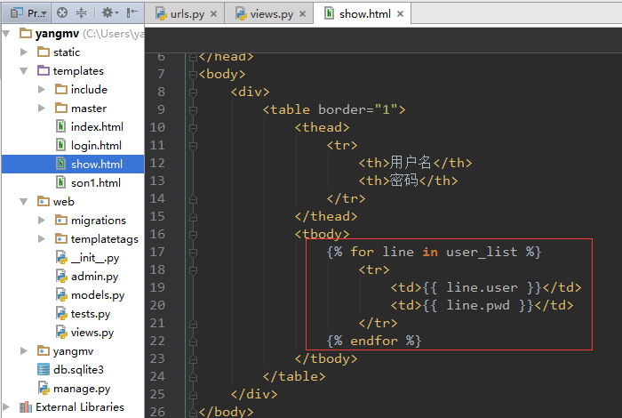


 成功获取数据:


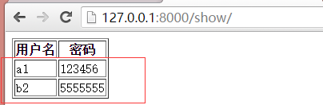

### 2、增

```
models.UserInfo.objects.create(user='yangmv',pwd='123456')
或者
obj = models.UserInfo(user='yangmv',pwd='123456')
obj.save()
```
 或者
```
dic = {'user':'yangmv','pwd':'123456'}
models.UserInfo.objects.create(**dic)
```

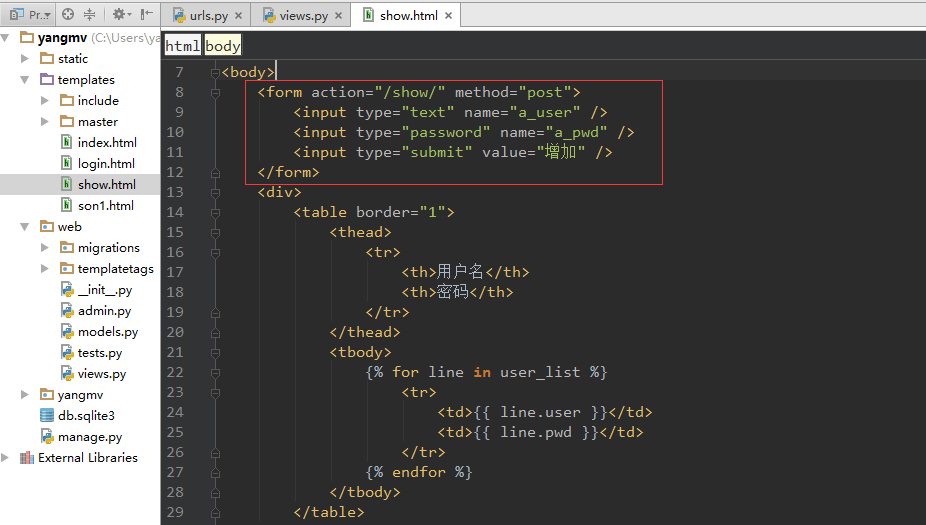

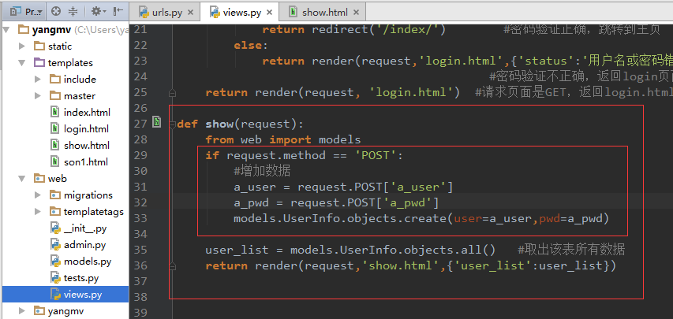

### 3、删

 `models.UserInfo.objects.filter(user='yangmv').delete()`

 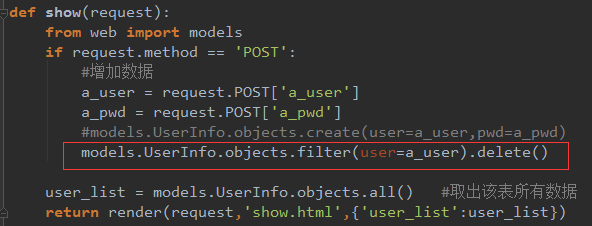
 
### 4、改

 `models.UserInfo.objects.filter(user='yangmv').update(pwd='520')`

 或者

```
obj = models.UserInfo.objects.get(user='yangmv')
obj.pwd = '520'
obj.save()
```
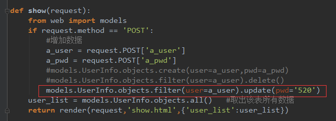

### 5、常用方法

```
#获取个数
#
#models.Tb1.objects.filter(name='seven').count()
#大于，小于
#
# models.Tb1.objects.filter(id__gt=1) # 获取id大于1的值
# models.Tb1.objects.filter(id__lt=10) # 获取id小于10的值
# models.Tb1.objects.filter(id__lt=10, id__gt=1) # 获取id大于1 且 小于10的值
# in
#
# models.Tb1.objects.filter(id__in=[11, 22, 33]) # 获取id等于11、22、33的数据
# models.Tb1.objects.exclude(id__in=[11, 22, 33]) # not in
# contains
#
# models.Tb1.objects.filter(name__contains="ven")
# models.Tb1.objects.filter(name__icontains="ven") # icontains大小写不敏感
# models.Tb1.objects.exclude(name__icontains="ven")
# range
#
# models.Tb1.objects.filter(id__range=[1, 2]) # 范围bettwen and
# 其他类似
#
# startswith，istartswith, endswith, iendswith,
# order by
#
# models.Tb1.objects.filter(name='seven').order_by('id') # asc
# models.Tb1.objects.filter(name='seven').order_by('-id') # desc
# limit 、offset
#
# models.Tb1.objects.all()[10:20]
# group by
from django.db.models import Count, Min, Max, Sum
# models.Tb1.objects.filter(c1=1).values('id').annotate(c=Count('num'))
# SELECT "app01_tb1"."id", COUNT("app01_tb1"."num") AS "c" FROM "app01_tb1" WHERE "app01_tb1"."c1" = 1 GROUP BY "app01_tb1"."id"
```
## 三、常用字段
#### models.DateTimeField　　日期类型 datetime

 参数，
`auto_now = True` ：则每次更新都会更新这个时间
`auto_now_add` 则只是第一次创建添加，之后的更新不再改变。

```
class UserInfo(models.Model):
name = models.CharField(max_length=32)
ctime = models.DateTimeField(auto_now=True)
uptime = models.DateTimeField(auto_now_add=True)
from web import models
def home(request):
models.UserInfo.objects.create(name='yangmv')
after = models.UserInfo.objects.all()
print after[0].ctime
return render(request, 'home/home.html')
```


### 1、表结构的修改

 表结构修改后，原来表中已存在的数据，就会出现结构混乱，makemigrations更新表的时候就会出错
解决方法：
1、新增加的字段，设置允许为空。生成表的时候，之前数据新增加的字段就会为空。(null=True允许数据库中为空，blank=True允许admin后台中为空)
2、新增加的字段，设置一个默认值。生成表的时候，之前的数据新增加字段就会应用这个默认值

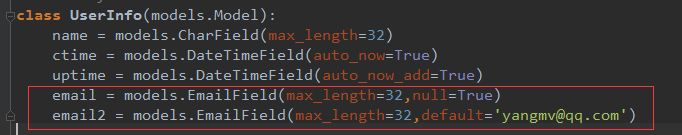

 执行makemigrations， migrate 后。老数据会自动应用新增加的规则

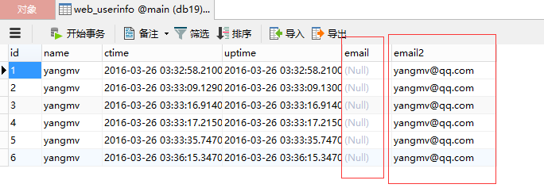

### `models.ImageField`                 图片
### `models.GenericIPAddressField`      IP
```
ip = models.GenericIPAddressField(protocol="ipv4",null=True,blank=True)
img = models.ImageField(null=True,blank=True,upload_to="upload")
```
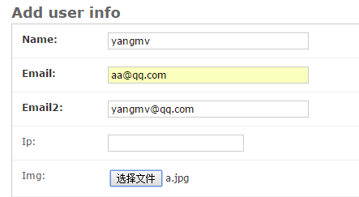

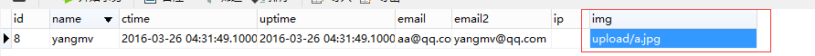

 数据库中保存的只是图片的路径

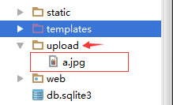

### 2、常用参数

#### 选择下拉框 choices

```
class UserInfo(models.Model):
USER_TYPE_LIST = (
(1,'user'),
(2,'admin'),
)
user_type = models.IntegerField(choices=USER_TYPE_LIST,default=1)
```

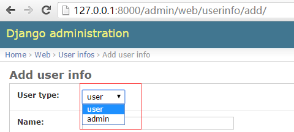


### 3、链表结构

- 一对多：`models.ForeignKey`(其他表); 
 
 一对多：当一张表中创建一行数据时，有一个单选的下拉框（可以被重复选择）

- 多对多：`models.ManyToManyField`(其他表)

 多对多：在某表中创建一行数据是，有一个可以多选的下拉框
 
 
例如：创建用户信息，需要为用户指定多个爱好


- 一对一：`models.OneToOneField`(其他表)

 一对一：在某表中创建一行数据时，有一个单选的下拉框（下拉框中的内容被用过一次就消失了

 *例如：原有含10列数据的一张表保存相关信息，经过一段时间之后，10列无法满足需求，需要为原来的表再添加5列数据*


#### 一对多:


```
class Game(models.Model):
gname = models.CharField(max_length=32)

class Host(models.Model):
hostname = models.CharField(max_length=32)
game = models.ForeignKey('Game')
```

**这是Game表，里面有3个业务**


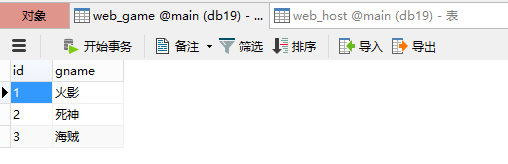


**这是主机表，可以通过外键，对应到Game表的业务的ID**


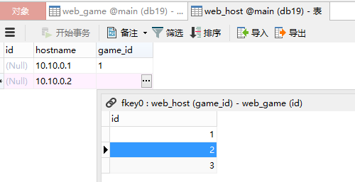


#### 多对多:

```
class UserGroup(models.Model):
group_name = models.CharField(max_length=16)

class User(models.Model):
name = models.CharField(max_length=16)
sex = models.CharField(max_length=16)
email = models.EmailField(max_length=32)
usergroup_user = models.ManyToManyField('UserGroup')
```

#### Django model会自动创建第3张关系表，用于对应user id 和usergroup id

**这是UserGroup表**


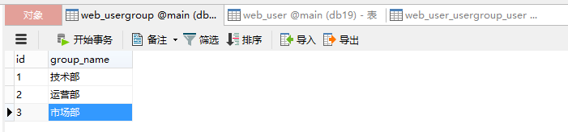


**这是User表**


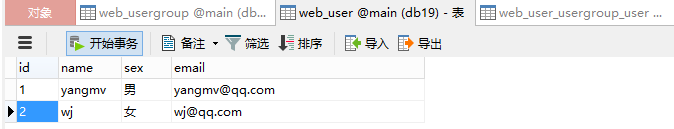


**这是Django自动生成的对应关系表**


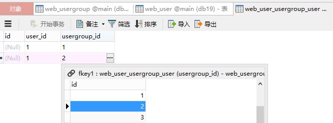


 user_id = 1 为 yangmv，同时属于1,2(技术部，运营部)
 

#### 一对一：   （一对多增加了不能重复）

```
class User2(models.Model):
name = models.CharField(max_length=16)
sex = models.CharField(max_length=16)
email = models.EmailField(max_length=32)

class Admin(models.Model):
username = models.CharField(max_length=32)
password = models.CharField(max_length=32)
admin_user2 = models.OneToOneField('User2')
```

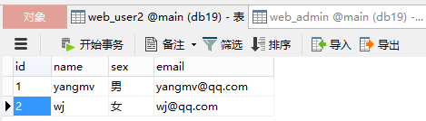


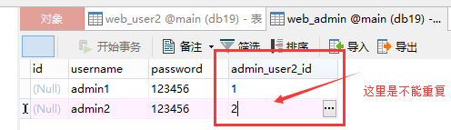


 **连接Mysql**
```
DATABASES ={
'default':{
'ENGINE':'django.db.backends.mysql',
'NAME':'dbname',
'USER':'root',
'PASSWORD':'xxx',
'HOST':'',
'PORT':'',
}
}
```

####  一对多操作实例

 首先生成2个表
```
from django.db import models

class Group2(models.Model):
caption = models.CharField(max_length=32)

class User2(models.Model):
username = models.CharField(max_length=32)
group2 = models.ForeignKey('Group2')

```
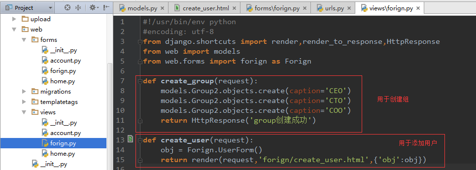


input和select标签用forms生成


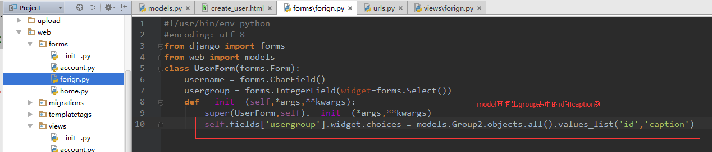


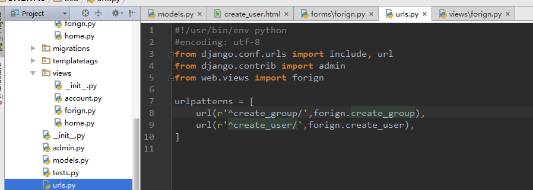


先执行create_group生成3个group


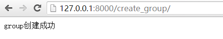


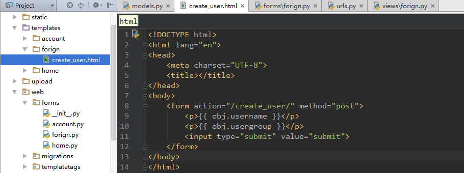


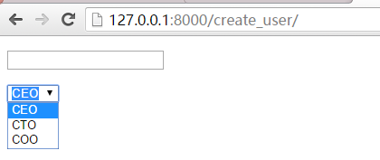


已经查询出Group数据

**添加**

**方法1,方法2**

```
def create_user(request):
obj = Forign.UserForm(request.POST)
if request.method == 'POST':
if obj.is_valid():
all_data = obj.clean()
#print all_data
#获取提交页面提交来的数据{'username': u'yang1', 'usergroup': 1}
#方法1，先获取对象，添加
#group_obj = models.Group2.objects.get(id=all_data['usergroup'])
#models.User2.objects.create(username=all_data['username'],usergroup=group_obj)
#方法2(推荐)
models.User2.objects.create(username=all_data['username'],group2_id=all_data['usergroup'])
#django会自动把数据库group2变为group2_id
else:
error = obj.errors
print error['username'][0]
print error['usergroup'][0]
return render(request,'forign/create_user.html',{'obj':obj})
```

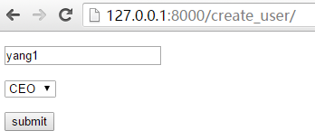

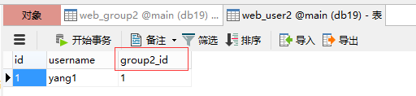

**方法3**

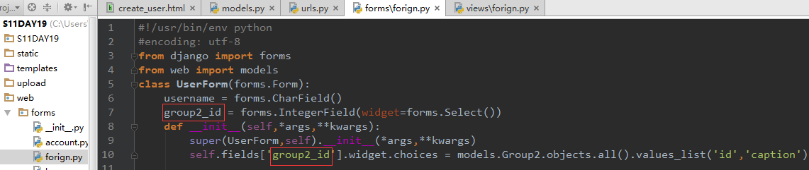

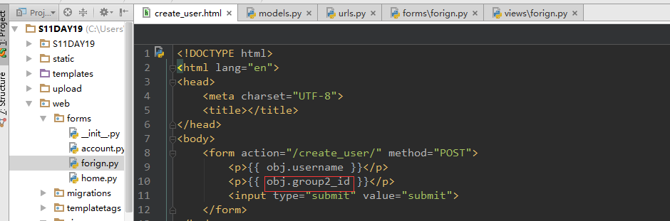

```
def create_user(request):
obj = Forign.UserForm(request.POST)
if request.method == 'POST':
if obj.is_valid():
all_data = obj.clean()
#print all_data
#获取提交页面提交来的数据{'username': u'yang1', 'usergroup': 1}
#方法1，先获取对象，添加
#group_obj = models.Group2.objects.get(id=all_data['usergroup'])
#models.User2.objects.create(username=all_data['username'],usergroup=group_obj)
#方法2(推荐)
#models.User2.objects.create(username=all_data['username'],group2_id=all_data['usergroup'])
#django会自动把数据库group2变为group2_id
#方法3(推荐)
models.User2.objects.create(**all_data)
print models.User2.objects.all().count()
else:
pass
# error = obj.errors
# print error['username'][0]
# print error['usergroup_id'][0]
return render(request,'forign/create_user.html',{'obj':obj})
```

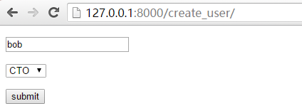

```
create_user(request):
obj = Forign.UserForm(request.POST)
if request.method == 'POST':
if obj.is_valid():
all_data = obj.clean()
#print all_data
#获取提交页面提交来的数据{'username': u'yang1', 'usergroup': 1}
#方法1，先获取对象，添加
#group_obj = models.Group2.objects.get(id=all_data['usergroup'])
#models.User2.objects.create(username=all_data['username'],usergroup=group_obj)
#方法2(推荐)
#models.User2.objects.create(username=all_data['username'],group2_id=all_data['usergroup'])
#django会自动把数据库group2变为group2_id
#方法3(推荐)
models.User2.objects.create(**all_data)
print models.User2.objects.all().count()
else:
pass
# error = obj.errors
# print error['username'][0]
# print error['usergroup_id'][0]
return render(request,'forign/create_user.html',{'obj':obj})
```

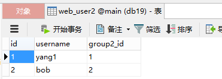

**查询.展示出所有的数据**

```
def create_user(request):
obj = Forign.UserForm(request.POST)
if request.method == 'POST':
if obj.is_valid():
all_data = obj.clean()
#方法3(推荐)
models.User2.objects.create(**all_data)
print models.User2.objects.all().count()
else:
pass
user_list = models.User2.objects.all()
return render(request,'forign/create_user.html',{'obj':obj,'user_list':user_list})
<table border="1">

<tr>
<td>{{ item.username }}</td>
<td>{{ item.group2.caption }}</td>
</tr>

</table>

```

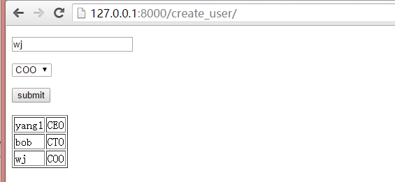

**GET方式查询**

```
def create_user(request):
obj = Forign.UserForm(request.POST)
if request.method == 'POST':
if obj.is_valid():
all_data = obj.clean()
#方法3(推荐)
models.User2.objects.create(**all_data)
print models.User2.objects.all().count()
else:
pass
#查用户
get_user = request.GET.get('username')
user_list = models.User2.objects.filter(username=get_user)
return render(request,'forign/create_user.html',{'obj':obj,'user_list':user_list})
```

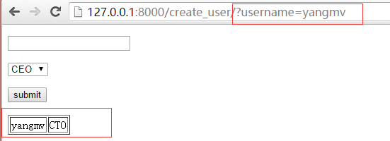

```
#查组
get_val = request.GET.get('group')
user_list = models.User2.objects.filter(group2__caption=get_val)

```

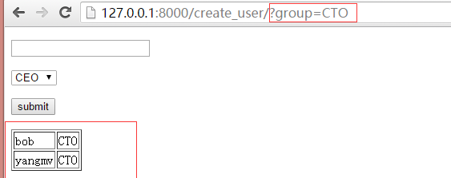

 一对多跨表操作，总结
1、group2对应的是一个对象
2、创建数据 group2_id ，直接查询数据库
3、获取数据，通过.     group2.caption
4、查询数据，通过__   group2__caption
